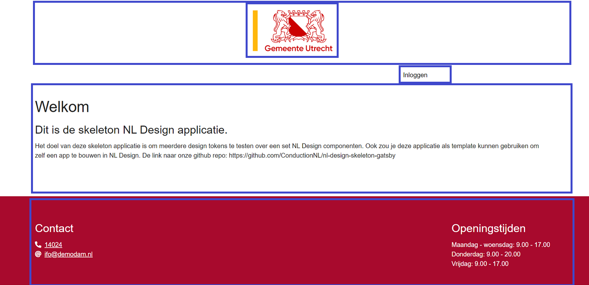
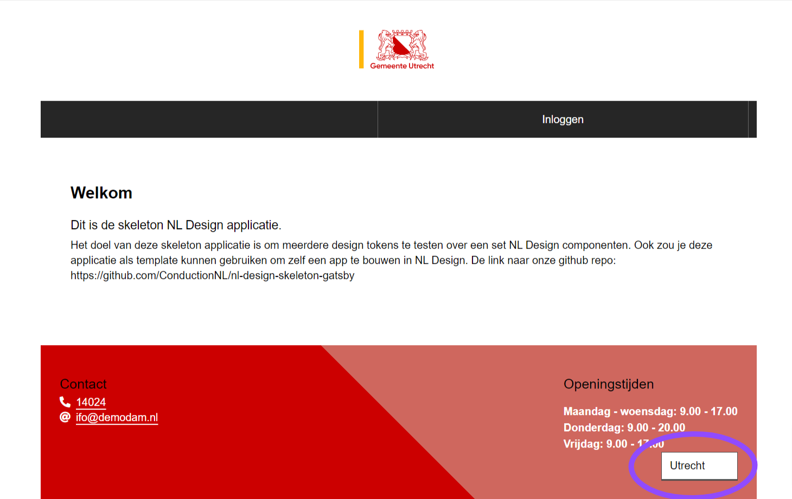
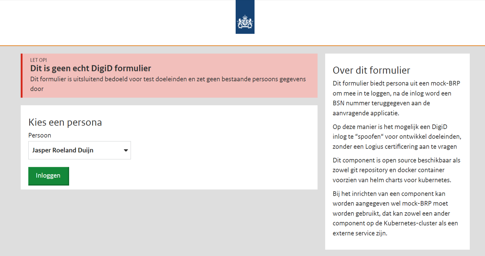

# Getting started

This page is an overview of working with the NL Design Skeleton application prototype called the Skeleton App. It is called the Skeleton app because you can customize the body(the part of HTML that users see when visiting an application). It is used to quickly spin up the application in its dressed-down version, ready for you to customize and test the NL [design tokens](https://designsystem.gebruikercentraal.nl/).

## Prerequisites

To work on the Skeleton application prototype, you should already have a basic understanding of the following.

-   [HTML](https://developer.mozilla.org/en-US/docs/Web/HTML)
-   [CSS](https://developer.mozilla.org/en-US/docs/Web/CSS)
-   [JavaScript](https://developer.mozilla.org/en-US/docs/Web/JavaScript) / [TypeScript](https://www.typescriptlang.org/)
-   [React](https://reactjs.org/)

Also, the app is statically built with [Next.js](https://nextjs.org/) or [Gatsby](https://www.gatsbyjs.com/), so a basic understanding of CLI interfaces and React frameworks will help a lot.

If you are looking to test the interactive functionality, the backend is provided via [the Commonground Gateway](https://github.com/ConductionNL/commonground-gateway).

## Example Application

You build the application with React and precisely one of the more known frameworks. React uses components that make it easy for developers to swap out certain parts of their frontend application, like a button, or more significant pieces, like headers. The picture below shows examples of components with blue borders.

If you need to change the header, you can change the code in the Header component. You could use that header in another application by importing that header. Same for every other component in React. They work like bricks, and you use them to build a structure. This works fine if you make small apps every now and then, but if you work in large organizations, these applications should look similar and do the same, right?

That's why organizations choose frameworks and libraries (React) to work together. Imagine if every municipality had to do everything themselves AND set up a similar codebase. The capital of Amsterdam could pull it off, but Rozendaal, with a 1700 population, would need a team to keep up with what the guys from the capital are doing.

## Design System

Introducing a design system. A design system is a collection of agreements between developers and designers to develop digital products like Progressive Web Applications like a municipality's website you visit on your desktop or phone. One of such agreements, for instance, is "everyone included". This means everyone could use the apps built with the design system, including people with disabilities.

Such a system consists of elementary components, tested and tried, that developers can use to uphold the agreements yet retain their own identity. Setting up a system like that takes a lot of effort, and it's never finished (so keep up with the developments), but it will save everybody time and energy maintaining the agreements.

## Design Tokens

Now that you know what a design system is let's look at how it works with our customizable Skeleton App. The Skeleton App is built for Dutch municipalities, but the concept could be applied to numerous other organizations.

The first picture showed you the different components, below is an example of how the entire User Interface is changed with the click of a button. The button is highlighted in blue.

The transformation is done with the `ThemeSwitcher` component, which uses design tokens. These tokens can be used interchangeably, and the tokens can be found [here](https://nl-design-system.github.io/themes/?path=/story/themes-intro--page).

## ThemeSwitcher

Changing a theme changes each component's CSS without manually updating each component. The ThemeSwitcher is connected to sets of objects with properties needed for the functionality. Adding objects to the ThemeSwitcher should look like:

`{ className: "utrecht-theme", title: "Utrecht", href: "https://unpkg.com/@utrecht/design-tokens/dist/theme/index.css", } `
The `className` (React mandates CSS-classes are called className) is part of the magic. Changing this class name changes the CSS like you otherwise would. The `title` is what you would read from the ThemeSwitcher dropup menu to select a theme. The `href` links the tokens hosted on the content delivery network.

## Logging in with the DigiD

The other main feature of the Skeleton App is showcasing how the login functionality works with the Dutch registration system DigiD. For the Skeleton app, we use [DigiSpoof](https://github.com/ConductionNL/digispoof-interface), where production PWA users would use their DigiD.

Utilizing this functionality takes the Skeleton app and the [Commonground Gateway](https://github.com/ConductionNL/commonground-gateway) to run locally. The development app will take you to [DigiSpoof](https://digispoof.common-ground.dev/) and in production, the login would take you to DigiD(Logius).

When you log in the Skeleton App, you request (via the Gateway API) a log in request to the SAML provider (DigiD/ DigiSpoof). This request is sent as a query parameter tot the SAML provider. This is where the user logs in.
The SAML provider sends you back to an endpoint on the Gateway with a digest that can retrieve the necessary data. The Gateway requests data with the [digest](https://developer.mozilla.org/en-US/docs/Web/HTTP/Headers/Digest), processes the data from the SAML provider and returns the session to the Skeleton App, and the user is logged in and stays logged in (Single Sign-On) until signing out. Signing out destroys the session.
